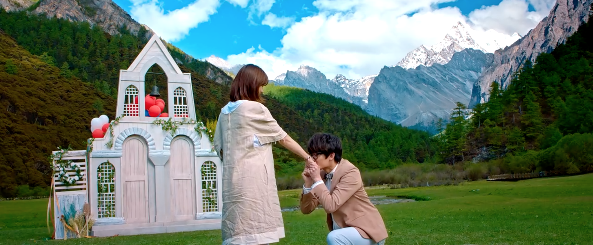
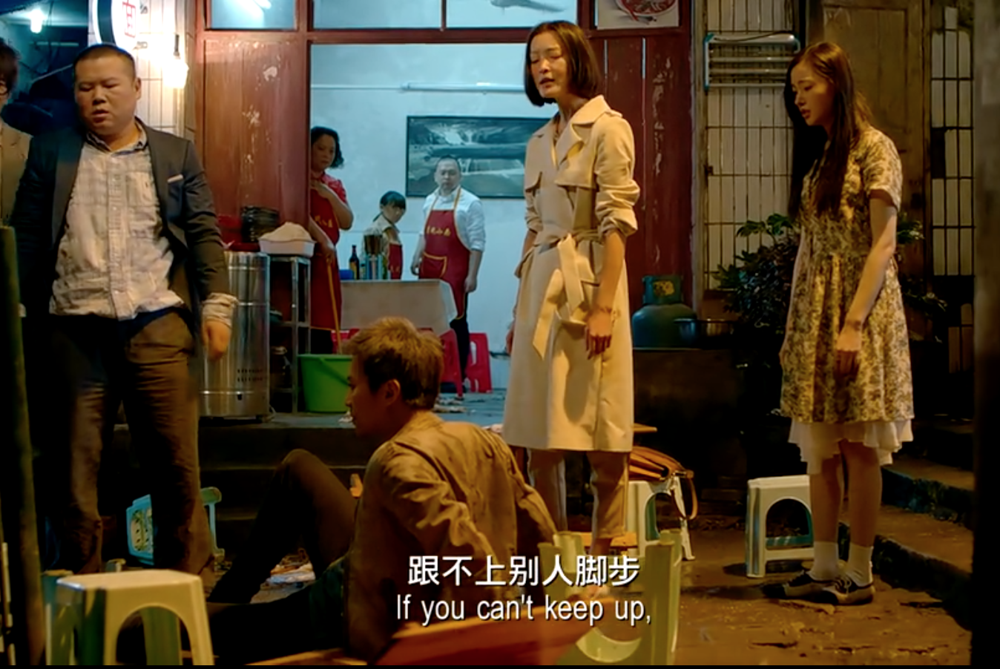
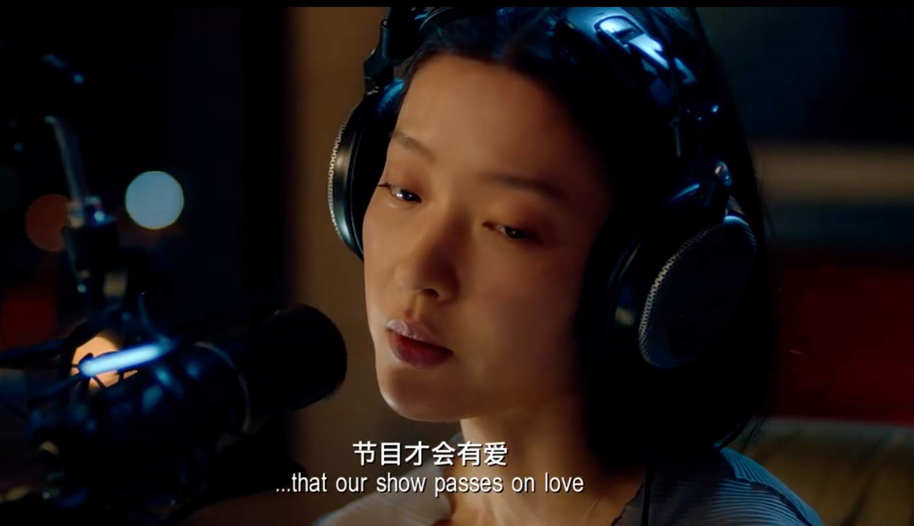
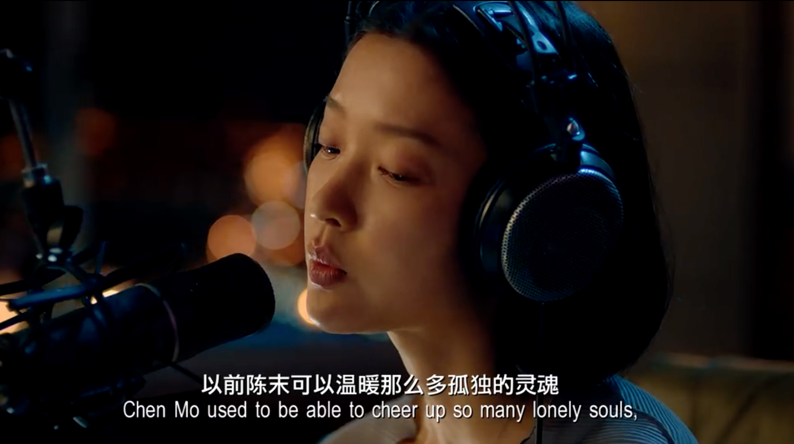

纯粹是打发时间写的这篇，实际上对这片可能并没有写出来的感觉那么心动，但因为搞了这个站这周末又很闲，看完还是想起来很多东西，于是准备多说几句。

***

首先这就是个传统意义上的爱情片，我看之前知道燕子没了你我怎么活啊那段，所以我是抱着看喜剧的心情去的，只看cut和岳云鹏我想当然的认为这是喜剧，但是挺多地方看得我抽抽噎噎的。

先从截图来吧，这片子是我这种不咋认识明星的人眼里的大牌云集，我估摸着成本不低，拍出了很多我这个土狗心里最浪漫的画面。

谁不爱藏区的雪山呢，主要是这个气球后面是用的特效，我就非常开心，如果真的放飞了这个气球我大概会生气（

谁不爱西藏的星空呢

之前为了看星星特意买了盗版书（？），研究星象什么的，希望有朝一日自己看到这样的星空的时候能说上个一二三，但是目前为止每次抬头天上还是只有一颗星。

然后我很喜欢这个镜头，这图压出来帧率变奇怪了，好像无人机飞着飞着卡了一样，片子里更流畅些。

以及后面男主那个：如果你们听到了，就为我打个双闪，让幺鸡知道我在找她。

这里城市大量车流打双闪的画面其实也挺触动的，而且估计只有重庆这种高低差非常大的城市能拍出这种感觉。但是估计效果不是很好实现，双闪也没有那么明显整齐划一的冲击，就没截图。

***

广播电台是一个很浪漫的玩意儿，离开了这座城市就很难听到了，我试着在海外听家乡的FM998黑龙江交通广播，但是永远只能听到卡顿的只言片语，也听不到叶文国良甩开腮帮子骂人，也没有风不转那二人转的大兵。

我意识到这件事其实就在片子一开头，因为哈尔滨好像是第二个出场的。

科技发达如现在，想听到家乡的广播还是很困难，是真正的离开了就散了，非常适合用来拍【路过】这个题材，其他媒体在这个时代已经很难尽意这种怅然若失悔之无及的遗憾了。

片子14：30的地方。

我都不知道他们怎么等到的哈尔滨这么美的天，第一个标志物是索菲亚教堂，比较有名，下面那个是龙塔，亚洲第一高钢塔，哈尔滨小学生十几年前必备的作文素材，除了这个还有丁香花小百科。

***

爱情题材之所以能共鸣，大概是因为这是人在有独立能力之后为数不多的、被大众推崇的、能够放纵自我个性解放、餍足自己冲动的情怀。

总之打着爱情的旗号，所有的不合常理都是痴情，所有的盲目都是深情，所有的固执都是长情，好像人生来就是为了寻找爱情，或者被爱情找到，再费尽心思殚精竭虑的去享受它。

这电影把【也不必如此，没必要】拍了个淋漓尽致。

三条爱情线男主是中规中矩的，茅十八那个梦幻又幼稚，岳云鹏那个又把现实过甚其词，导致每个故事看起来多多少少都有点膈应。

电影48分钟的时候茅十八说自己那个导航仪会一直陪着女警的时候我就有不好的预感。

太刻意了哥哥【

因为真的提前有明显的感觉并且进行了自我预警，最后我反而没怎么被这个戳到，人死后细腻的陪伴这种在日本作品里看的更多，警惕性比较高……但是有一说一这种我还是很容易哭到，另外这个题材最戳我泪点的还是大鱼海棠的【我会化作人间的风和雨陪在你身边】和余命彼氏3的【到雪融化春天到来的时候，我已经不在你的身边了，但再次下起雪的时候，你要记得想起我。】

不过其实我不讨厌这段戏，因为茅十八颜值太能打了，我虽然不认识杨洋的脸（看了之后被戳到搜了才知道这个就是杨洋），但还是被一个镜头狠狠帅到了。

这谁受得了……

虽然我下次见杨洋十有八九还是不认识，但是真帅啊（（

但是这小老弟的死没必要，那女警起码50%责任，我觉得他完全有救。

***

然后岳云鹏这条线吧……太出圈了前因后果也没啥大意思，因为邓超说柳岩偷钱岳云鹏为此大打出手那一段，我感觉比起维护女神形象，更多的还是他无法背叛自己为之付出了一切的青春时的选择。

***

男主这条线那个傻逼女人看得我非常火大，尤其是街边大排档那段戏，拉了整体演技一个档次不说，剧情安排的台词也极其迷惑。

你自己说得出来吗？

这段姑且理解为她觉得男主拖她事业后腿了，但是分手的时候她说的可是【你是一个好DJ但不是一个好恋人】。

男主可是在这个女人说分手的时候还漫不经心的温暖拯救了一个姑娘，他说稻城的时候看的人是谁啊？难道精神出问题的没有爱的不是你自己吗？在这哔哔赖赖大言不惭，还在男主要走出阴影迎接新生活的时候突然搞这么一出恶心人，后面天台男主给她机会想要和好，她又他妈去追求事业去了，真正搞不清楚要什么的不就是你自己吗？

恶心人这个角色。。演技好点就算了，说【就不要抱怨！！】那句话的时候那个台词真的难受得我想冲进去给她人撕烂。

在这个狗一样的女人的衬托下，男主显得非常好男人……有点像奋斗里的向南……

但是还好最后没选杨晓芸选了遥遥！！！

不知道为什么提起奋斗我对这个恶心人的女总监又是一股邪火涌上心头（（

***

很好，在完全无所谓的烂片上浪费了三四个小时，今天也过完了，收工（（